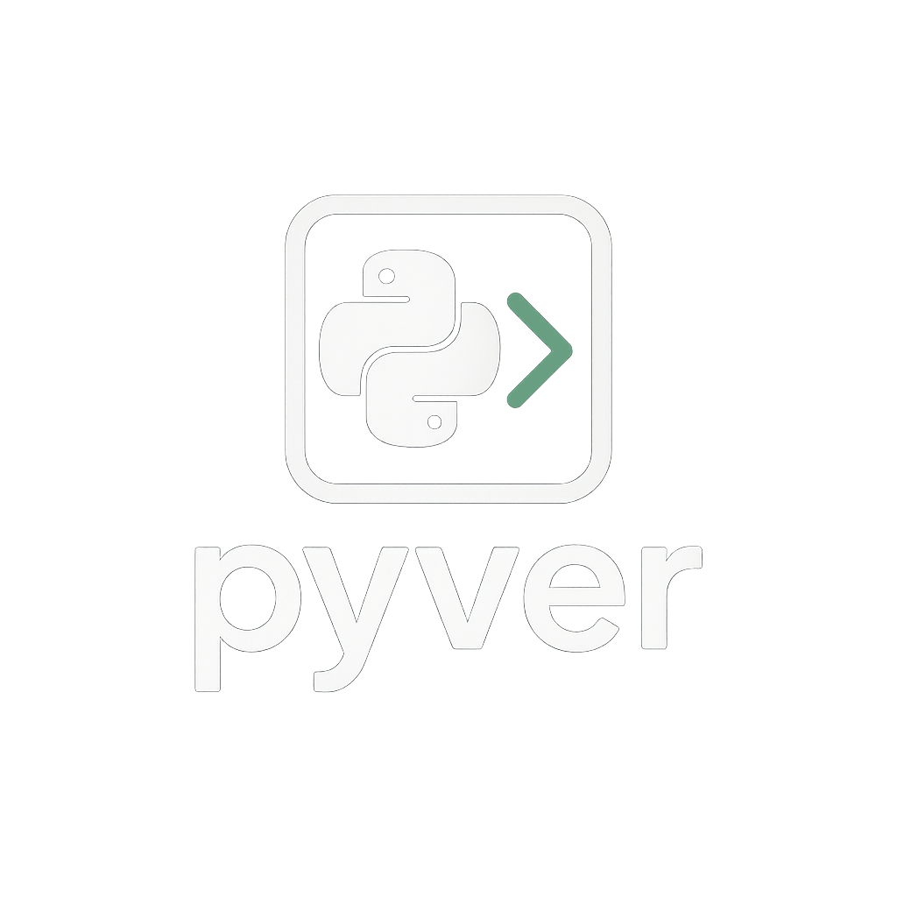

<!-- Logo and Title -->
<p align="center">
  
</p>

<h1 align="center">pyver</h1>

<p align="center">
  <b>PEP 440-compliant version parsing and comparison for Go</b><br>
  <i>Fast, robust, and standards-driven. Python reference backend included for full confidence.</i>
</p>

<p align="center">
  <a href="https://github.com/rvben/pyver/actions"></a>
  <a href="https://pkg.go.dev/github.com/rvben/pyver"></a>
  <a href="https://goreportcard.com/report/github.com/rvben/pyver"></a>
  <!-- Add more badges as needed -->
</p>

---

## Overview

**pyver** is a Go library for parsing, normalizing, and comparing version strings according to [PEP 440](https://peps.python.org/pep-0440/), the Python packaging versioning standard. It is designed for:

- **Go projects** that need to interoperate with Python packaging/versioning
- **Tooling** that must handle Python-style versions natively in Go
- **Developers** who want robust, standards-compliant version logic with full test coverage

The library includes a Go-native implementation and an optional Python reference backend (using `packaging.version.Version`) for debugging and compliance checks.

---

## Features

- 🚀 **Go-native PEP 440 parser and comparator** (default)
- 🐍 **Python reference backend** for debugging and parity
- ✅ **Comprehensive test suite** (parsing, normalization, comparison, roundtrip, edge cases)
- 🔄 **Switchable implementation** for migration and regression testing
- 🧪 **CI/CD** with full test coverage on every push and PR
- 📦 **Zero dependencies** for Go-native mode
- 📝 **Semantic versioning** and easy release workflow

---

## Quickstart

### 1. Add pyver to Your Go Project

```sh
go get github.com/rvben/pyver
```

This will add pyver to your `go.mod` file. Run `go mod tidy` to ensure all dependencies are up to date:

```sh
go mod tidy
```

### 2. Import and Use pyver

Add an import to your Go code:

```go
import "github.com/rvben/pyver"
```

### 3. Minimal Example

Create a file `main.go`:

```go
package main

import (
    "fmt"
    "github.com/rvben/pyver"
)

func main() {
    v1, err := pyver.Parse("1.0rc1")
    if err != nil {
        panic(err)
    }
    v2, err := pyver.Parse("1.0")
    if err != nil {
        panic(err)
    }

    switch pyver.Compare(v1, v2) {
    case -1:
        fmt.Println("1.0rc1 < 1.0")
    case 0:
        fmt.Println("1.0rc1 == 1.0")
    case 1:
        fmt.Println("1.0rc1 > 1.0")
    }

    fmt.Println("Normalized:", v1.Normalized)
}
```

Run your program:

```sh
go run main.go
```

_If you are contributing to pyver, see the [Contributing](#contributing) section below for testing and development instructions._

---

## Usage

### Parse and Compare Versions

```go
import "github.com/rvben/pyver"

v1, err := pyver.Parse("1.0rc1")
v2, err := pyver.Parse("1.0")

if pyver.Compare(v1, v2) < 0 {
    fmt.Println("1.0rc1 < 1.0")
}

fmt.Println(v1.Normalized) // "1.0rc1"
```

### Switch Implementation Mode

By default, pyver uses the Go-native implementation. To use the Python backend (for debugging):

```go
pyver.UseGoNative = false // Use Python reference backend
```

Or set the environment variable:

```sh
export USE_GO_NATIVE=0
```

---

## Implementation Modes

- **Go-native (default):** Fast, dependency-free, and fully PEP 440-compliant.
- **Python reference:** Uses `pyver_backend.py` and the `packaging` library for gold-standard compliance and debugging. Useful for regression tests and edge cases.

---

## Release & Versioning

- Follows [semantic versioning](https://semver.org/)
- Use `make release-patch`, `make release-minor`, or `make release-major` to tag and push new releases
- Releases are published on GitHub and trigger full CI

---

## Contributing

Contributions are welcome! Please:

- Ensure all tests pass (`make test` and `make test-python`)
- Follow Go best practices and idiomatic style
- Add tests for new features or bugfixes
- Open a pull request with a clear description

---

## License

[MIT](LICENSE)

---

<p align="center">
  <i>pyver is built for reliability, standards-compliance, and developer happiness.</i>
</p>
